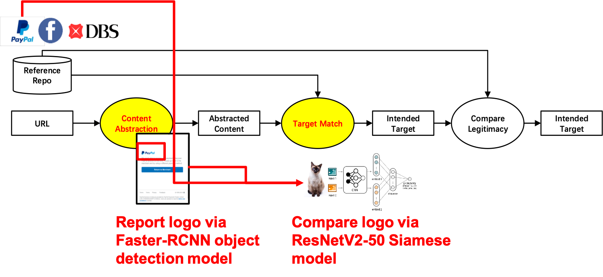

# Phishpedia A Hybrid Deep Learning Based Approach to Visually Identify Phishing Webpages

- This is the official implementation of "Phishpedia: A Hybrid Deep Learning Based Approach to Visually Identify Phishing Webpages" USENIX'21 [link to paper](https://www.usenix.org/system/files/sec21fall-lin.pdf), [link to our website](https://sites.google.com/view/phishpedia-site/home?authuser=0)
- The contributions of our paper:
   - [x] We propose a phishing identification system Phishpedia, which has high identification accuracy and low runtime overhead, outperforming the relevant state-of-the-art identification approaches. 
   - [x] Our system provides explainable annotations which increases users' confidence in model prediction
   - [x] We conduct phishing discovery experiment on emerging domains fed from CertStream and discovered 1,704 real phishing, out of which 1133 are zero-days   

## Framework
    


```Input```: A URL and its screenshot ```Output```: Phish/Benign, Phishing target
- Step 1: Enter <b>Deep Object Detection Model</b>, get predicted logos and inputs (inputs are not used for later prediction, just for explaination)

- Step 2: Enter <b>Deep Siamese Model</b>
    - If Siamese report no target, ```Return  Benign, None```
    - Else Siamese report a target, ```Return Phish, Phishing target``` 
    
## Project structure
```
- src
    - adv_attack: adversarial attacking scripts
    - detectron2_peida: training script for object detector
     |_ output
      |_ rcnn_2
        |_ rcnn_bet365.pth 
    - siamese_pedia: inference script for siamese
     |_ siamese_retrain: training script for siamese
     |_ expand_targetlist
         |_ 1&1 Ionos
         |_ ...
     |_ domain_map.pkl
     |_ resnetv2_rgb_new.pth.tar
    - siamese.py: main script for siamese
    - pipeline_eval.py: evaluation script for general experiment

- tele: telegram scripts to vote for phishing 
- phishpedia_config.py: config script for phish-discovery experiment 
- phishpedia_main.py: main script for phish-discovery experiment 
```
       
## Requirements

Windows machine 

python=3.7 

torch>=1.6.0 

torchvision>=0.6.0

Install compatible Detectron2 manually, see the [official installation guide](https://detectron2.readthedocs.io/en/latest/tutorials/install.html). If you are using Windows, try this [guide](https://dgmaxime.medium.com/how-to-easily-install-detectron2-on-windows-10-39186139101c) instead.

Then, run
```
pip install -r requirements.txt
```

## Instructions

<!-- ### 1. Download all the model files:
- First download [Siamese model weights](https://drive.google.com/file/d/1H0Q_DbdKPLFcZee8I14K62qV7TTy7xvS/view?usp=sharing),
[Logo targetlist](https://drive.google.com/file/d/1_C8NSQYWkpW_-tW8WzFaBr8vDeBAWQ87/view?usp=sharing),
[Brand domain dictionary](https://drive.google.com/file/d/1qSdkSSoCYUkZMKs44Rup_1DPBxHnEKl1/view?usp=sharing), put them under **src/siamese_pedia**

- Then download [Object detector weights](https://drive.google.com/file/d/1tE2Mu5WC8uqCxei3XqAd7AWaP5JTmVWH/view?usp=sharing),
put it under **src/detectron2_pedia/output/rcnn_2**
 -->

### 1. Unzip logo targetlist:
- Unzip the logo targetlist
```bash
cd src/siamese_pedia/
unzip expand_targetlist.zip -d expand_targetlist
```
- If logo targetlist cannot be successfully unzipped, try download the folder [here](https://drive.google.com/file/d/1_C8NSQYWkpW_-tW8WzFaBr8vDeBAWQ87/view?usp=sharing) manually instead.
- Your directory should be look like the project structure shown above in Project directory section.

### 2. Download all data files 
- Download [Phish 30k](https://drive.google.com/file/d/12ypEMPRQ43zGRqHGut0Esq2z5en0DH4g/view?usp=sharing), 
[Benign 30k](https://drive.google.com/file/d/1yORUeSrF5vGcgxYrsCoqXcpOUHt-iHq_/view?usp=sharing) dataset,
unzip and move them to **datasets/**

### 3. Run experiment 
- For phish discovery experiment, the data folder should be organized in [this format](https://github.com/lindsey98/Phishpedia/tree/main/datasets/test_sites):
```bash
python phishpedia_main.py --folder [data folder you want to test] --results [xxx.txt]
```
- For general experiment on phish30k and benign30k: 
please run evaluation scripts
```bash
python -m src.pipeline_eval --data-dir datasets/phish_sample_30k --mode phish --write-txt output_phish.txt --ts [threshold for siamese, 0.83 is suggested]
python -m src.pipeline_eval --data-dir datasets/benign_sample_30k --mode benign --write-txt output_benign.txt --ts [threshold for siamese, 0.83 is suggested]
```

## Training the model (Optional)
### 1. If you want to train object detection faster-rcnn model yourself, 
- First dowonload [training data](https://drive.google.com/file/d/1L3KSWEXcnWzYdJ4hPrNEUvC8jaaNOiBa/view?usp=sharing) to **datasets/**
- Second step is to create folder to save trained weights and log:
```
mkdir src/detectron2_pedia/output
```
- Then start training 
To train on a single gpu:
```bash
python -m src.detectron2_pedia.train_net \
       --config-file src/detectron2_pedia/configs/faster_rcnn.yaml
```

To train on multiple gpus:
```bash
python -m src.detectron2_pedia.train_net \
       --num-gpus 4 \
       --config-file src/detectron2_pedia/configs/faster_rcnn.yaml
```

To resume training from a checkpoint (finds last checkpoint from cfg.OUTPUT_DIR)
```bash
python -m src.detectron2_pedia.train_net \
       --num-gpus 4 \
       --config-file src/detectron2_pedia/configs/faster_rcnn.yaml \
       --resume
```
<!-- - Launch [DAG](http://openaccess.thecvf.com/content_ICCV_2017/papers/Xie_Adversarial_Examples_for_ICCV_2017_paper.pdf) adversarial attack on Faster-RCNN:
```
python -m src.detectron2_pedia.run_DAG \
    --cfg-path src/detectron2_pedia/configs/faster_rcnn.yaml \
    --weights-path src/detectron2_pedia/output/rcnn_2/rcnn_bet365.pth \
    --results-save-path coco_instances_results.json \
    --vis-save-dir saved
``` -->

### 2. If you want to train siamese
Our training has two stages: In first stage, we use the dataset [Logo2K+](https://arxiv.org/abs/1911.07924) published in AAAI'20 to pretrain; in second stage we finetune the model on our logo targetlist
- We first pretrained on the [Logos2k data](https://drive.google.com/file/d/1zAIp97e8VlFHLwtuZU3Sg1OlvuOPUJJW/view?usp=sharing), [Logo2k training list](https://drive.google.com/file/d/19NuNiy9yv6jDyPruce5MLSQDhFVkcbav/view?usp=sharing), [logo2k testing list](https://drive.google.com/file/d/1-uTDQT_f0nC4lrVf-0Rfz2c9ZyZnhqjz/view?usp=sharing), [logo2k labeldict](https://drive.google.com/file/d/1adCjkccF2gpPvvbkBu3MUvEmfAVcNpOL/view?usp=sharing) dataset, using a pretrained BiT-M ResNet50x1 model, which we have to download first:
```
wget https://storage.googleapis.com/bit_models/BiT-M-R50x1.npz # download pretraind weights
```
- This command runs the pre-training on the downloaded model:
```bash
python -m src.siamese_pedia.siamese_retrain.bit_pytorch.train \
    --name {exp_name} \  # Name of this run. Used for monitoring and checkpointing.
    --model BiT-M-R50x1 \  # Which pretrained model to use.
    --logdir {log_dir} \  # Where to log training info.
    --dataset logo_2k \  # Name of custom dataset as specified and self-implemented above.
```
- Saving and utilizing the weights in the previous step, we finetune the model on our logo targetlist dataset:
Download [Logo targetlist](https://drive.google.com/file/d/1cuGAGe-HubaQWU8Gwn0evKSOake6hCTZ/view?usp=sharing), 
[Logo targetlist for training](https://drive.google.com/file/d/1GirhWiOVQpJWafhHA93elMfsUrxJzr9f/view?usp=sharing),
[Logo targetlist for testing](https://drive.google.com/file/d/12GjdcYeSBbPji8pCq5KrFhWmqUC451Pc/view?usp=sharing),
put them under **src/siamese_pedia/siamese_retrain**.
Run
```bash
python -m src.siamese_pedia.siamese_retrain.bit_pytorch.train \
    --name {exp_name} \  # Name of this run. Used for monitoring and checkpointing.
    --model BiT-M-R50x1 \  # Which pretrained model to use.
    --logdir {log_dir} \  # Where to log training info.
    --dataset targetlist \  # Name of custom dataset as specified and self-implemented above.
    --weights_path {weights_path} \  # Path to weights saved in the previous step, i.e. bit.pth.tar.
```
<!-- - Launch adversarial attack ([i-FGSM](https://arxiv.org/pdf/1412.6572.pdf), [i-StepLL](https://arxiv.org/pdf/1611.01236.pdf), [DeepFool](https://arxiv.org/pdf/1511.04599.pdf), [C&W L2](https://arxiv.org/pdf/1608.04644.pdf), [BPDA with Linf-PGD](https://arxiv.org/pdf/1802.00420.pdf)) on siamese:
Run src/adv_attack/gradient masking siamese.ipynb  -->

 
<!-- ## Telegram service to label found phishing (Optional)
### Introduction
- When phishing are reported by the model, users may also want to manually verify the intention of the websites, thus we also developed a telegram-bot to help labeling the screenshot. An example is like this 
- In this application, we support the following command:
```
/start # this will return all the unlabelled data
/get all/date # this will return the statistics for all the data namely how many positive and negatives there are
/classify disagree # this will bring up phishing pages with any disagreement, ie one voted not phishing and one voted phishing for a revote
```
### Setup tele-bot
- 1. Create an empty google sheet for saving the results (foldername, voting results etc.)
- 2. Follow the [guide](https://www.analyticsvidhya.com/blog/2020/07/read-and-update-google-spreadsheets-with-python/) to download JSON file which stores the credential for that particular google sheet, save as **tele/cred.json**
- 3. Go to **tele/tele.py**, Change 
```
token = '[token for telebot]' 
folder = "[the folder you want to label]"
```
[How do I find token for telebot?](https://core.telegram.org/bots#botfather)
- 4. Run **tele/tele.py** -->


## Reference 
If you find our work useful in your research, please consider citing our paper by:
```
@inproceedings{lin2021phishpedia,
  title={Phishpedia: A Hybrid Deep Learning Based Approach to Visually Identify Phishing Webpages},
  author={Lin, Yun and Liu, Ruofan and Divakaran, Dinil Mon and Ng, Jun Yang and Chan, Qing Zhou and Lu, Yiwen and Si, Yuxuan and Zhang, Fan and Dong, Jin Song},
  booktitle={30th $\{$USENIX$\}$ Security Symposium ($\{$USENIX$\}$ Security 21)},
  year={2021}
}
```

## Miscellaneous
- In our paper, we also implement several phishing detection and identification baselines, see [here](https://github.com/lindsey98/PhishingBaseline)
- The logo targetlist decribed in our paper includes 181 brands, we have further expanded the targetlist to include 277 brands in this code repository 
- We did not include the Certstream code in this repo, our Certstream code is the same as [Phish_catcher](https://github.com/x0rz/phishing_catcher), we lower the score threshold to be 40 to process more suspicious websites, readers can refer to their repo for details
- We also did not include the crawling script in this repo, readers can use [Selenium](https://selenium-python.readthedocs.io/), [Scrapy](https://github.com/scrapy/scrapy) or any web-crawling API to crawl the domains obtained from Cerstream, just make sure that the crawled websites are stored in [this format](https://github.com/lindsey98/Phishpedia/tree/main/datasets/test_sites)
