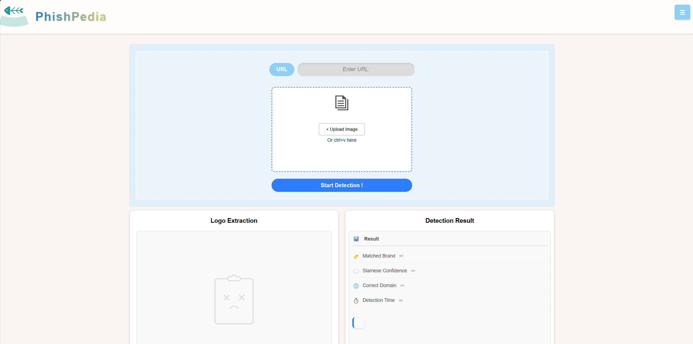
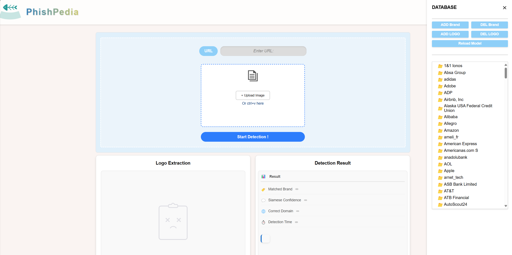

# Phishpedia Web Tool

This is a web tool for Phishpedia which provides a user-friendly interface with brand and domain management capabilities, as well as visualization features for phishing detection.

## Installation Requirements

Before using, make sure all necessary dependencies are installed:

```bash
~Phishpedia$ cd WEBtool
~Phishpedia/WEBtool$ pip install -r requirements.txt
```

## How to Run

Run the following command in the web tool directory:

```bash
~Phishpedia/WEBtool$ export PYTHONPATH=..
~Phishpedia/WEBtool$ python phishpedia_gui.py
```

you should see an URL after the server is started (http://127.0.0.1:500x). Visit it in your browser.

## User Guide

### 1. Main Page (For phishing detection)



1. **URL Detection**
   - Enter the URL to be tested in the "Enter URL" input box
   - Click the "Upload Image" button to select the corresponding website screenshot
   - Click the "Start Detection!" button to start detection
   - Detection results will be displayed below, including text results and visual presentation
2. **Result Display**
   - The original image with logo extracted will be displayed in the "Logo Extraction" box
   - Detection results will be displayed in the "Detection Result" box, together with a synthetic explanation
   - You can clearly see the detected brand identifiers and related information


### 2. Sidebar (For database management)

Click the sidebar button "☰" at top right corner, this will trigger a sidebar showing database at backend.



1. **Brand Management**
   - Click "Add Brand" to add a new brand
   - Enter brand name and corresponding domains in the form
   - Click one brand to select, and click "Delete Brand" to remove the selected brand
   - Double-click one brand to see the logo under this brand
2. **Logo Management**
   - Click one brand to select, and click "Add Logo" to add brand logos
   - Click one logo to select, and click "Delete Logo" to remove selected logo
3. **Data Update**
   - After making changes, click the "Reload Model" button
   - The system will reload the updated dataset

## Main Features

1. **Phishing Detection**
   - URL input and detection
   - Screenshot upload and analysis
   - Detection result visualization

2. **Brand Management**
   - Add/Delete brands
   - Add/Delete brand logos
   - Domain management
   - Model reloading

## Directory Structure

```
WEBtool/
├── static/             # Static resources like css,icon
├── templates/          # Web page 
├── phishpedia_web.py   # A flask server
├── utils_web.py        # Help functions for server
├── readme.md           # Documentation
└── requirements.txt    # Dependency list
```
